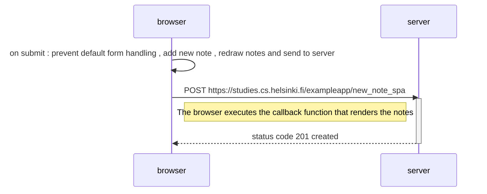

```mermaid
sequenceDiagram
participant browser
participant server

    browser ->>browser: on submit : prevent default form handling , add new note , redraw notes and send to server
    browser->>server: POST https://studies.cs.helsinki.fi/exampleapp/new_note_spa
    activate server
    Note right of browser: The browser executes the callback function that renders the notes
    server-->>browser: status code 201 created
    deactivate server

    
    
    

    
```
